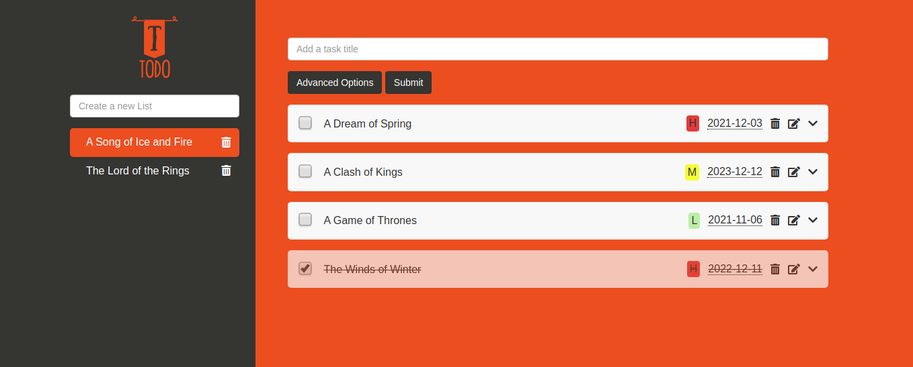

# To-do List App

> A Javascript To-Do List app, which allows the user to create tasks with descpritions, due date and it's priority. Alongside these features, you are able to create numerous lists for different projects. The app uses mostly JS and webpack as a module bundler



## Built With

- Javascript
- HTML
- CSS

## Live Demo

[Live Demo Link](https://rawcdn.githack.com/abouhid/ToDo_list/a197af7d187ba32312cbb632062acbcec30b6fee/dist/index.html)

## Getting Started

To get a local copy up and running follow these simple example steps.

```
git clone https://github.com/abouhid/ToDo_list.git
Open the index.html
Explore the website
```

## Authors

👤 **Azamat Nuriddinov**

- Github: [@bettercallazamat](https://github.com/bettercallazamat)
- Twitter: [@azamat_nuriddin](https://twitter.com/azamat_nuriddin)
- Linkedin: [Azamat Nuriddinov](https://www.linkedin.com/in/azamat-nuriddinov-57579868)

👤 **Alexandre Bouhid**

- Github: [@abouhid](https://github.com/abouhid)
- LinkedIn: [Alexandre Bouhid](https://www.linkedin.com/in/alexandrebouhid/)

## 🤝 Contributing

Contributions, issues and feature requests are welcome!

## Show your support

Give a ⭐️ if you like this project!

## 📝 License

This project is [MIT](lic.url) licensed.
